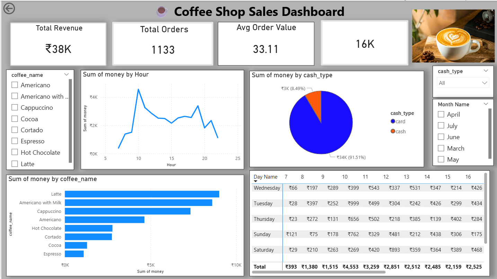

# ☕ Coffee Shop Sales Analysis Dashboard

## 📌 Overview
This project analyzes coffee shop sales data using Python and Power BI to uncover business insights.

## 🛠️ Tools Used
- Python (Pandas, Matplotlib, Seaborn)
- Power BI
- Jupyter Notebook

## 📊 Dashboard Features
- KPI Metrics (Revenue, Orders, Avg Order Value)
- Sales Trend Analysis (Hourly)
- Top Product Analysis
- Payment Method Insights
- Heatmap (Day vs Hour)
- Interactive Filters

## 📸 Dashboard Preview

## 📈 Key Insights
- Most payments are done via card
- Peak sales occur during morning and evening hours
- Top products: Latte, Cappuccino, Americano
- Sales are consistent across days

## 🚀 Conclusion
This dashboard helps understand customer behavior and optimize sales strategy.
